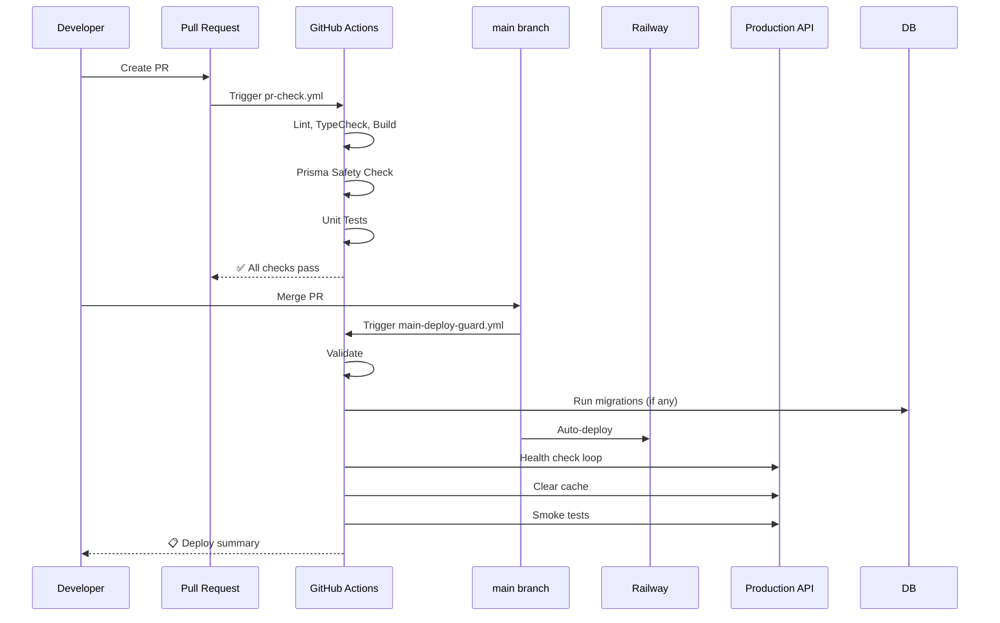

# CI/CD Pipeline Documentation

This document describes the CI/CD pipeline setup for the Gold Shop App, designed to prevent production breaks from Prisma migrations, stale cache issues, and API contract breaks.

## Overview

```
┌─────────────────────────────────────────────────────────────────────────┐
│                        GOLD SHOP CI/CD PIPELINE                         │
├─────────────────────────────────────────────────────────────────────────┤
│                                                                         │
│   PULL REQUEST                    MAIN BRANCH                           │
│   ┌─────────────┐                ┌─────────────┐                       │
│   │ pr-check.yml│                │ main-deploy │                       │
│   └──────┬──────┘                │  -guard.yml │                       │
│          │                       └──────┬──────┘                       │
│          ▼                              │                              │
│   ┌──────────────┐              ┌───────▼───────┐                      │
│   │ Install Deps │              │  Validation   │                      │
│   └──────┬───────┘              └───────┬───────┘                      │
│          │                              │                              │
│   ┌──────▼──────┐               ┌───────▼───────┐                      │
│   │ Lint + Type │               │   Migrations  │──── If new SQL files │
│   │   Check     │               └───────┬───────┘                      │
│   └──────┬──────┘                       │                              │
│          │                       ┌──────▼──────┐                       │
│   ┌──────▼──────┐               │  Railway    │ (auto-deploy)         │
│   │ Build Test  │               │   Deploy    │                       │
│   └──────┬──────┘               └──────┬──────┘                       │
│          │                              │                              │
│   ┌──────▼──────┐               ┌──────▼──────┐                       │
│   │   Prisma    │               │   Health    │                       │
│   │   Safety    │               │   Check     │                       │
│   └──────┬──────┘               └──────┬──────┘                       │
│          │                              │                              │
│   ┌──────▼──────┐               ┌──────▼──────┐                       │
│   │  Unit Tests │               │ Cache Clear │                       │
│   └─────────────┘               └──────┬──────┘                       │
│                                        │                              │
│                                 ┌──────▼──────┐                       │
│                                 │ Smoke Tests │                       │
│                                 └─────────────┘                       │
│                                                                         │
└─────────────────────────────────────────────────────────────────────────┘
```

## Workflows

### 1. PR Check (`pr-check.yml`)

**Trigger:** Pull requests to `main` or `develop`

**Purpose:** Validate changes before merging to prevent breaking production.

**Stages:**

| Stage | Description | Blocking? |
|-------|-------------|-----------|
| 📦 Install | Install dependencies with frozen lockfile | ✅ |
| 🔍 Lint | Run ESLint on API and Web | ✅ |
| 📝 TypeCheck | TypeScript compilation check | ✅ |
| 🏗️ Build | Verify both apps build successfully | ✅ |
| 🗃️ Prisma Safety | Validate schema, check migrations | ✅ |
| 🧪 Tests | Run unit tests (PostgreSQL service) | ⚠️ Soft fail |

**Prisma Safety Checks:**
- `prisma validate` - Schema syntax
- `prisma format` - Schema formatting
- `prisma migrate diff` - Schema drift detection
- Destructive migration detection (DROP TABLE, DROP COLUMN, etc.)

### 2. Deploy Guard (`main-deploy-guard.yml`)

**Trigger:** Push to `main`

**Purpose:** Safe deployment to production with health checks.

**Stages:**

| Stage | Description | Critical? |
|-------|-------------|-----------|
| 🔐 Validate | Build verification before deploy | ✅ |
| 🗃️ Migrate | Run `prisma migrate deploy` if new migrations | ✅ |
| 🚂 Monitor | Wait for Railway deploy, health check | ⚠️ |
| 🧹 Clear Cache | Refresh metal rate cache | ⚠️ |
| 💨 Smoke Tests | Test critical endpoints | ⚠️ |

### 3. Manual Operations (`manual-ops.yml`)

**Trigger:** Manual workflow dispatch

**Operations:**

| Operation | Description |
|-----------|-------------|
| `clear-metal-cache` | Clear cache for specific region/currency |
| `warm-market-cache` | Pre-fetch rates for all regions |
| `db-health-check` | Verify database connectivity |
| `full-smoke-test` | Run comprehensive endpoint tests |
| `force-refresh-rates` | Force refresh all market rates |

**Options:**
- Environment: `production` / `staging`
- Dry run mode
- Region/currency selection

## Required Secrets

Configure these in GitHub Repository Settings → Secrets and variables → Actions:

| Secret | Description | Example |
|--------|-------------|---------|
| `DATABASE_URL` | Production Neon PostgreSQL URL | `postgresql://...` |
| `STAGING_DATABASE_URL` | Staging database URL | `postgresql://...` |
| `PRODUCTION_API_URL` | Railway API URL | `https://api.example.com` |
| `STAGING_API_URL` | Staging API URL | `https://staging-api.example.com` |
| `ADMIN_API_TOKEN` | JWT token for admin operations | `eyJhbG...` |

## Health Endpoints

New endpoints added for monitoring:

| Endpoint | Method | Description |
|----------|--------|-------------|
| `/health` | GET | Comprehensive health status |
| `/health/live` | GET | Kubernetes liveness probe |
| `/health/ready` | GET | Kubernetes readiness probe |
| `/health/ping` | GET | Simple connectivity test |

**Health Response Example:**
```json
{
  "status": "healthy",
  "timestamp": "2024-01-15T10:30:00Z",
  "version": "1.0.0",
  "uptime": 3600,
  "checks": {
    "database": {
      "status": "up",
      "latency": 15,
      "lastChecked": "2024-01-15T10:30:00Z"
    },
    "marketRates": {
      "status": "up",
      "latency": 5,
      "message": "Last update: 2024-01-15T10:00:00Z",
      "lastChecked": "2024-01-15T10:30:00Z"
    }
  }
}
```

## Scripts

Local scripts for operations (run from project root):

```bash
# Run smoke tests against an API
pnpm smoke-test                           # Default: localhost:3001
API_URL=https://api.example.com pnpm smoke-test

# Check migrations for destructive changes
pnpm check-migrations

# Clear metal rate cache
pnpm clear-cache                          # All regions
pnpm clear-cache NP NPR                   # Specific region
API_URL=https://api.example.com ADMIN_API_TOKEN=xxx pnpm clear-cache

# Warm market rate cache
pnpm warm-cache
```

## Deployment Flow

### Standard Deployment



### Handling Migration Failures

If migrations fail during deploy:

1. **Pipeline stops** - App continues running with old code
2. **Check logs** - Review migration error in Actions
3. **Options:**
   - Fix migration and re-push
   - Manual intervention via `prisma migrate resolve`
   - Rollback if data corruption risk

### Handling Cache Issues

If market rates are stale:

1. **Manual trigger** - Use `manual-ops.yml`
2. **Select operation** - `force-refresh-rates`
3. **Monitor** - Check response in workflow logs

Or use CLI:
```bash
API_URL=https://your-api.railway.app \
ADMIN_API_TOKEN=your-token \
pnpm clear-cache
```

## Troubleshooting

### PR Checks Failing

| Error | Cause | Fix |
|-------|-------|-----|
| "lockfile out of sync" | `pnpm-lock.yaml` not updated | Run `pnpm install` locally |
| "Prisma format" | Schema not formatted | Run `npx prisma format` |
| "Schema drift" | Pending migration | Run `npx prisma migrate dev` |
| "Destructive migration" | DROP detected | Review and confirm intentional |

### Deploy Guard Failing

| Error | Cause | Fix |
|-------|-------|-----|
| "Migration failed" | DB schema conflict | Check migration SQL, may need manual fix |
| "Health check timeout" | App not starting | Check Railway logs |
| "Smoke test failed" | Endpoint broken | Review recent changes |

### Health Endpoint Issues

```bash
# Check locally
curl http://localhost:3001/health | jq

# Check production
curl https://your-api.railway.app/health | jq
```

## Best Practices

1. **Always run `pnpm install`** after changing dependencies
2. **Run `npx prisma format`** before committing schema changes
3. **Test migrations locally** with `npx prisma migrate dev`
4. **Use staging** for risky changes
5. **Check destructive warnings** seriously - backup data first
6. **Monitor cache freshness** - market rates should update within 1 hour

## Railway Configuration

Ensure Railway is configured for auto-deploy:

1. **Linked to GitHub repo** - `main` branch
2. **Dockerfile builder** - Using `railway.json`
3. **Environment variables** set:
   - `DATABASE_URL`
   - `REDIS_HOST` / `REDIS_PORT`
   - `METALPRICE_API_KEY`
   - `JWT_SECRET`

## Vercel Configuration

Frontend auto-deploys from `main`:

1. **Root Directory**: `apps/web`
2. **Framework Preset**: Next.js
3. **Environment Variables**:
   - `NEXT_PUBLIC_API_URL`
   - `NEXTAUTH_URL`
   - `NEXTAUTH_SECRET`
